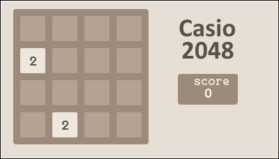
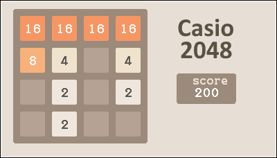

# 2048 for the Casio fx-cg 10/20/50
Use the correct file for your calculator
Casio fx-cg 10/20 -> 2048 (cg-10)(cg-20).g3a
Casio fx-cg 50    -> 2048 (cg-50).g3a

If there are no graphics showing up try using the other file.
This programm is under the GNU V3 license

## Screenshots

